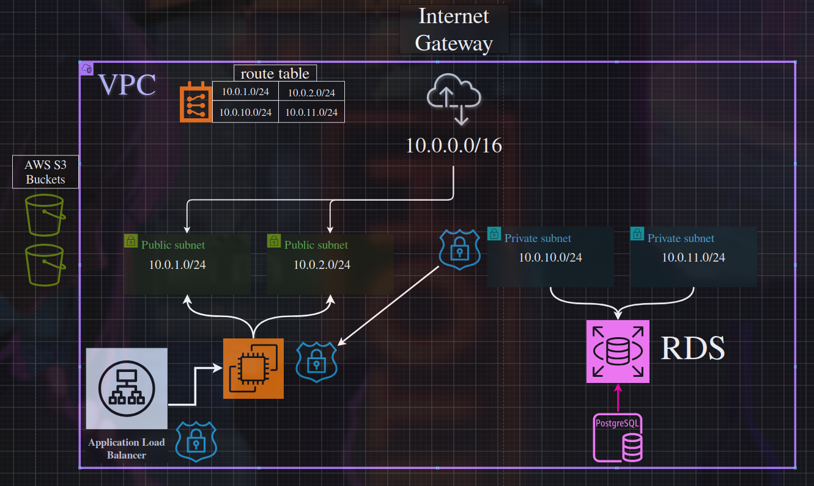

# Infrastructure

Terraform modules that provision the complete AWS environment for the TechFlow Cloud Toolkit.

## What this deploys

| Resource | Module | Purpose |
|----------|--------|---------|
| VPC | `vpc` | Networking: 2 public + 2 private subnets across 2 AZs |
| ALB | `alb` | Application Load Balancer in public subnets |
| EC2 | `ec2` | Compute instances behind the ALB |
| RDS | `rds` | PostgreSQL instance in private subnets |
| S3 | `s3` | Buckets for logs and backups |
| IAM | `iam` | Roles, policies, and instance profiles |

## Architecture & Modules

- **Modular design**: Each service is an independent module with its own variables, outputs, and resources. This makes the infrastructure scalable and reusable.
- **Private data tier**: RDS lives in private subnets with no public access.
- **Least privilege IAM**: Roles and policies scoped to the minimum required permissions.
- **Dynamic AMI selection**: The EC2 module uses an `aws_ami` data source to always fetch the latest Amazon Linux 2 AMI.
- **IP-based SSH access**: The EC2 security group restricts SSH to the deployer's current IP via an `http` data source.

### Traffic flow

```
Internet → IGW → ALB (public subnets) → EC2 (public subnets) → RDS (private subnets)
```

S3 is accessed via IAM from EC2.



## State Management

Terraform state is stored in S3 with native locking (`use_lockfile`) to prevent concurrent modifications.

```hcl
terraform {
  backend "s3" {
    bucket       = "techflow-terraform-state-leandro2026"
    key          = "techflow/terraform.tfstate"
    region       = "us-east-2"
    use_lockfile = true
  }
}


## Prerequisites

- Terraform >= 1.5
- AWS CLI configured with credentials
- S3 bucket for remote state (created manually once)
- SSH key pair for EC2 access

## Setup

### 1. Create the S3 bucket for remote state

```bash
aws s3api create-bucket \
  --bucket techflow-terraform-state-leandro2026 \
  --region us-east-2 \
  --create-bucket-configuration LocationConstraint=us-east-2
```

### 2. Generate SSH key pair

```bash
ssh-keygen -t rsa -b 4096 -f modules/ec2/my-key-techflow
```

### 3. Create your local tfvars file

Copy the example file and fill in your real values:

```bash
cp terraform.tfvars.example terraform.tfvars
```

Then edit `terraform.tfvars` with your data. **Never commit this file.**

### 4. Initialize and deploy

```bash
terraform init
terraform plan
terraform apply
```

### 5. Destroy when done

```bash
terraform destroy
```

## Outputs

| Output | Description |
|--------|-------------|
| `ec2_public_ip` | Public IP of the EC2 instance |
| `s3_bucket_names` | Names of the created S3 buckets |
| `rds_endpoint` | Connection endpoint for the PostgreSQL instance |

## Future Improvements

- [ ] Add NAT Gateway for private subnet outbound access (RDS updates, CloudWatch Logs)
- [ ] Add CloudWatch alarms for EC2 and RDS
- [ ] Implement blue/green deployment for zero-downtime updates
- [ ] Add WAF rules to the ALB

